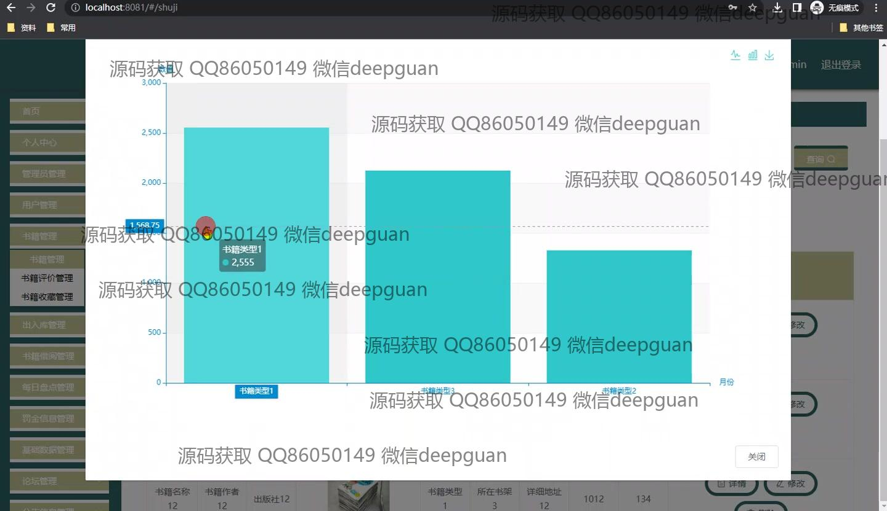

<h1 align="center">基于 html 的图书管理系统</h1>

## 简介
HTML5图书管理系统：角色分为管理员和用户；系统包含书籍管理、用户管理、论坛互动、公告信息、借阅和书籍出入库管理等多功能模块，支持用户与管理员对图书和论坛信息进行全面管理与操作。    --计算机毕业设计源码；毕设源码；java毕业设计源码

## 联系方式

<h3 align="center">获取完整代码与数据库文件 + 微信：deepguan QQ: 86050149 QQ群: 783742310</h3>

<h3 align="center">可帮忙远程部署 包运行成功！提供远程部署、修改代码、设计文档指导、代码讲解等服务！</h3>

## 功能介绍（完整见运行截图）
管理员：主要负责系统管理，可以进行用户管理、图书管理、出入库管理以及论坛管理。可以查看和管理用户信息、权限，并对书籍进行增删改查操作，管理出入库记录，确保系统正常运行和数据安全。  
用户：提供图书浏览、借阅、收藏和评论功能。用户可以查看书籍详情，进行借阅操作，还可以在论坛中发布帖子和评论，与其他用户互动交流。同时，用户能够管理个人信息，查看借阅历史和罚金信息。

## 运行截图

本代码来源于网络,仅供学习参考使用!

